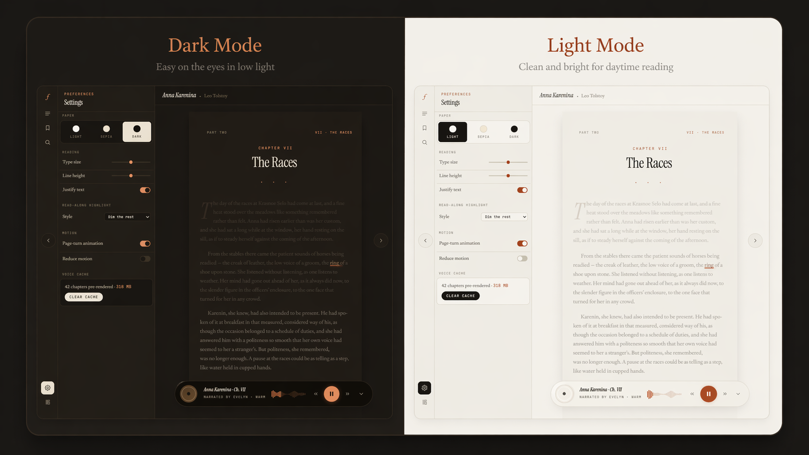

# Folio

Folio is a desktop-first PDF and EPUB reader with built-in text-to-speech, synchronized playback, and a library experience designed for long-form reading.



## Overview

Most reading tools treat listening as an afterthought. Folio is built around a different idea: reading and listening should feel like the same activity. The app keeps text, navigation, and playback aligned so a book can move naturally between silent reading and spoken playback.

- Drop in a PDF or EPUB and start reading immediately
- Turn books into followable, sentence-aware audio playback
- Keep your place with bookmarks, persistent progress, and recent-book history
- Search across the full text of the current book
- Switch between a faithful PDF view and reflowed EPUB reading
- Choose reading voices, playback speed, theme, motion, and highlight style
- Use local model-backed playback with GPU acceleration when available

## At A Glance

| Area | What Folio does |
| --- | --- |
| Formats | Reads PDF and EPUB files |
| Playback | Supports local TTS playback with synchronized sentence progress |
| Navigation | Includes chapters, bookmarks, recent books, and full-text search |
| Experience | Offers theme controls, motion settings, reader highlighting, and desktop-style launch flow |
| Runtime | Uses a React frontend, FastAPI backend, and local model assets via Git LFS |

## Highlights

- **Two reading modes**: paged PDF reading and chapter-based EPUB reflow
- **Integrated TTS playback**: on-device Kokoro voices with a curated narrator list
- **Reader-following audio**: playback advances through sentences and can keep the view synced
- **Preloaded chapter audio**: prepares a chapter before playback for smoother listening
- **Search and navigation**: full-book search, bookmarks, chapter navigation, and recent titles
- **Desktop-friendly launcher**: starts the local server and opens the app in a standalone browser window
- **Persistent library state**: remembers theme, voice, progress, and recent books between sessions

## Stack

- Frontend: React 19, Vite
- Backend: FastAPI, Uvicorn
- PDF processing: PyMuPDF
- EPUB parsing: EbookLib, Beautiful Soup, lxml
- TTS: `kokoro-onnx`, ONNX Runtime
- Packaging style: local desktop workflow via `launcher.pyw`

## Demo-Friendly Feature Set

- **Library home** with recent books and resume state
- **Reading progress memory** across sessions
- **Sentence-aware playback** with voice and speed controls
- **Search panel** for navigating directly to passages
- **Bookmarks panel** for saving return points
- **Theme and motion settings** for different reading preferences

## Repository Layout

```text
.
|-- backend/        FastAPI server, parsing, search, and TTS services
|-- frontend/       React UI, reader views, settings, and library experience
|-- launcher.pyw    Windows launcher for the standalone desktop-style experience
|-- README.md
|-- CONTRIBUTING.md
|-- LICENSE
```

## Getting Started

### Prerequisites

- Python 3.11+ recommended
- Node.js 20+ recommended
- Git LFS

### 1. Clone the repository

```powershell
git clone https://github.com/Retrorerr/Folio.git
cd Folio
git lfs pull
```

### 2. Install backend dependencies

```powershell
python -m pip install -r backend/requirements.txt
```

### 3. Download Kokoro model assets

Folio expects the full-quality English Kokoro v1.0 ONNX model at `backend/models/kokoro-v1.0.onnx` and the voice file at `backend/models/voices-v1.0.bin`:

```powershell
python backend/setup_kokoro_models.py
```

The setup command first tries the GitHub `kokoro-onnx` v1.0 model release, then falls back to the Hugging Face `onnx-community/Kokoro-82M-v1.0-ONNX` `onnx/model.onnx` source for the model. Regardless of source, the local model is saved as `kokoro-v1.0.onnx`.

### 4. Install frontend dependencies

```powershell
cd frontend
npm install
cd ..
```

### 5. Build the frontend

```powershell
cd frontend
npm run build
cd ..
```

### 6. Launch Folio

For the desktop-style flow on Windows:

```powershell
python launcher.pyw
```

For backend development directly:

```powershell
cd backend
python -m uvicorn main:app --host 127.0.0.1 --port 8000
```

If you run the backend directly, start the frontend dev server in a second terminal:

```powershell
cd frontend
npm run dev
```

## Development Notes

- The backend serves the production frontend build from `frontend/dist`
- Runtime book data, uploads, generated audio, and local state are intentionally excluded from git
- Large model binaries in `backend/models` are tracked with Git LFS
- Tauri packaging is scaffolded under `src-tauri/`; see `docs/packaging.md`
- For Tauri packaging, keep the app bundle read-only and point runtime paths at app data with `KOKORO_READER_DATA_DIR`, `KOKORO_READER_UPLOAD_DIR`, and `KOKORO_READER_AUDIO_CACHE_DIR`
- `KOKORO_READER_MODELS_DIR` and `KOKORO_READER_FRONTEND_DIR` can relocate bundled model assets and the built frontend
- The frontend can call an external backend origin by setting `VITE_API_BASE`; the default remains same-origin for the current FastAPI-served build

## Notes On Models

Folio uses Kokoro-only local speech generation. The normal reader model is the full-quality English Kokoro v1.0 ONNX model:

```text
backend/models/kokoro-v1.0.onnx
```

Keep `backend/models/voices-v1.0.bin` beside it. If you manually download Hugging Face's `model.onnx`, run `python backend/setup_kokoro_models.py` so it is normalized to `kokoro-v1.0.onnx`.

Folio does not silently download models on startup. If the full-quality model is missing, startup/status logs tell you to run:

```powershell
python backend/setup_kokoro_models.py
```

The old `backend/models/kokoro-v1.0.int8.onnx` file is only used as an emergency fallback when the full-quality model is missing or cannot load/run.

Some large local speech models are tracked with Git LFS. After cloning, you can still run:

```powershell
git lfs pull
```

Without that step, any LFS-tracked files in `backend/models` will only exist as pointers and playback will not work correctly.

To compare the quality model against the int8 emergency fallback, run:

```powershell
python backend/tts_benchmark.py --compare --output-dir backend/tts_debug_wavs_compare
```

## Current Scope

Folio currently focuses on:

- Local reading of PDF and EPUB files
- On-device or locally served speech generation
- Persistent reading state and navigation
- A refined solo-reader workflow on Windows

## Roadmap

- Better onboarding and first-run setup checks
- Easier model management and download flow
- Packaging for simpler installation
- Richer library metadata and cover handling
- Export and sharing options for notes/bookmarks

## Positioning

Folio is currently best suited for local-first personal reading on Windows, especially for users who want a cleaner bridge between visual reading and spoken playback than traditional ebook tools usually offer.

## Contributing

Contributions, fixes, and polish are welcome. See [CONTRIBUTING.md](CONTRIBUTING.md) for the workflow and expectations.

## License

This project is released under the [MIT License](LICENSE).
