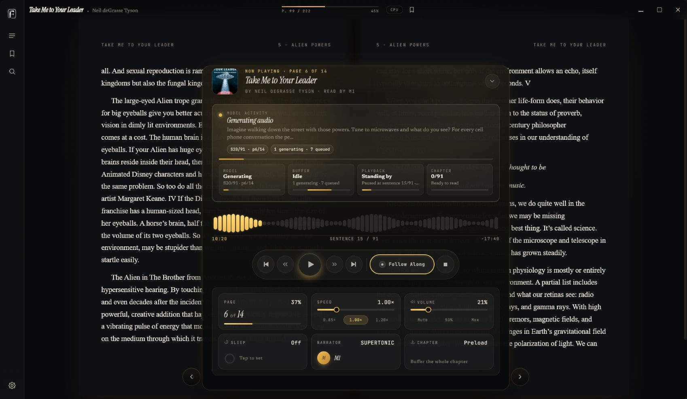

# Folio

**A local-first Windows reader for moving between EPUB text and natural narration without losing your place.**

Folio turns an EPUB library into a quiet reading desk: open a book, pick a line, press play, and follow sentence-aware local narration with a cursor that stays tied to the text. Books, reading state, audio cache, and model files stay on your machine.




## Why Folio

Most EPUB readers treat reading and listening as separate modes. Folio is built around the handoff between them.

- **Local narration:** Generate speech with Supertonic 3 or Kokoro from the desktop app.
- **Sentence-aware playback:** Start from a selected line, follow the live reading position, and resume from saved progress.
- **Visible model activity:** The expanded playback pill shows current generation, queued buffer, playback state, and chapter readiness.
- **No mystery startup:** The loading screen reports backend, model, hardware, RAM, and app-shell progress.
- **Library dashboard:** Continue reading, search metadata, see reading goals, recent books, counts, and highlights.
- **Folder auto-scan:** Choose a library folder and scan for newly added EPUBs.
- **Windows-native shell:** Tauri packaging, custom titlebar, instant window close, and backend sidecar lifecycle management.

## Screens In Motion

The playback pill is the heart of Folio. It can stay compact while reading, then expand into a detailed console for narration, speed, volume, sleep timer, narrator choice, chapter preload, and buffer status.

The reader cursor is line-aware rather than just page-aware. It supports hover, selected-line, and playback states, hides during page turns, and keeps Follow Along responsible for turning pages only when the reader asks for it.

## Install

Download the latest Windows installer from GitHub Releases and run:

```text
Folio_<version>_x64-setup.exe
```

The installer includes the desktop shell and bundled backend sidecar. Voice models are installed on demand when narration is requested, so theme changes, opening a book, or browsing settings will not repeatedly prompt for a model download.

Runtime data is stored under:

```text
%APPDATA%\com.folio.reader
```

That folder contains uploaded books, reading state, generated audio cache, model metadata, and backend logs.

## Current Capabilities

- EPUB import, recent books, metadata search, and dashboard summaries.
- Reflowed two-page reader with chapter navigation, page turns, bookmarks, and search.
- Supertonic 3 and Kokoro narration engines with per-book engine, voice, and speed settings.
- Detailed generation and buffering telemetry in the expanded playback pill.
- Follow Along mode that keeps the visible page aligned with the current reading position.
- Settings panel for themes, narrator selection, model install state, cache maintenance, updates, and auto-scan folder selection.
- Local FastAPI backend protected by an app-scoped token in preview and packaged builds.
- Tauri Windows installer with bundled resources and sidecar startup/shutdown handling.

## Android

Folio also has a native Android target built on the same React reader UI. Android does not start the Windows FastAPI/PyInstaller sidecar: EPUB and PDF files are parsed locally, library state and reflow data are kept in app-private IndexedDB storage, and file access uses Android's Storage Access Framework. The mobile Tauri plugin owns persistent document-tree permissions, local ONNX inference, and Media3 playback.

Android setup, model-pack layout, and the validation commands are documented in [docs/android.md](docs/android.md). The first Android build requires Android Studio, a JDK, the Android SDK/NDK, CMake, and the Rust Android targets; the build script also prepares the local eSpeak NG phonemizer bridge. This checkout does not vendor the large Kokoro or Supertonic model files. Narration remains unavailable with an explicit error until a compatible, integrity-pinned local model pack is installed; Folio never relabels the Android speech service as either neural engine and contacts no cloud backend.

## Development

### Requirements

- Windows
- Node.js 20+
- Python 3.11+
- Rust and Cargo
- Tauri build prerequisites for Windows

### Install Dependencies

```powershell
npm install
npm --prefix frontend install
```

Backend dependencies are installed by the project scripts. For manual backend work:

```powershell
cd backend
pip install -r requirements.txt
```

### Run Locally

Tauri development mode:

```powershell
npm run tauri:dev
```

Codex/browser preview mode:

```powershell
npm run preview:codex:restart
```

Manual frontend/backend debugging:

```powershell
cd backend
python -m uvicorn main:app --host 127.0.0.1 --port 8000
```

```powershell
cd frontend
npm run dev
```

### Validate

```powershell
npm --prefix frontend run typecheck
npm --prefix frontend run lint
npm --prefix frontend run test
npm --prefix frontend run build
npm run backend:test -- --SkipInstall
```

## Build The Installer

From the repo root:

```powershell
npm run tauri:build
```

The build script:

- builds the Python backend sidecar;
- builds the React frontend for the Tauri runtime;
- packages the Windows installer with Tauri;
- copies bundled resources from `src-tauri/resources`.

Installer output:

```text
src-tauri\target\release\bundle\nsis\
```

## Repository Layout

```text
backend/       FastAPI app, EPUB parsing, reflow, covers, search, and TTS
frontend/      React + TypeScript reader UI
docs/          Packaging notes and screenshots
scripts/       Windows build, install, and preview helpers
src-tauri/     Tauri shell, resources, icons, and sidecar wiring
```

## Logs

Installed app logs are written to:

```text
%APPDATA%\com.folio.reader\backend.log
```

Use this log to inspect backend startup, model discovery, book loading, TTS generation, and shutdown.

## Release Notes

Before publishing a release, update versions in:

- `package.json`
- `package-lock.json`
- `src-tauri/Cargo.toml`
- `src-tauri/tauri.conf.json`

Then build and attach the installer from the NSIS bundle folder to a GitHub Release.

## License

Folio is released under the [MIT License](LICENSE).
